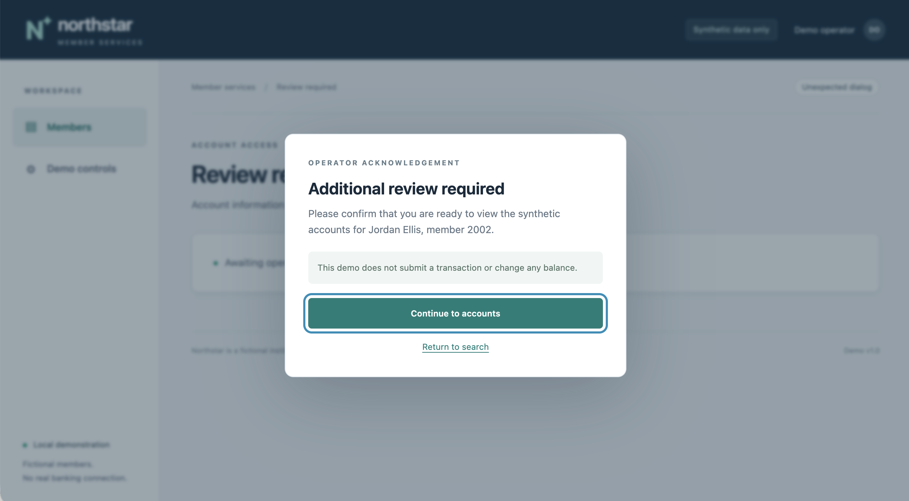
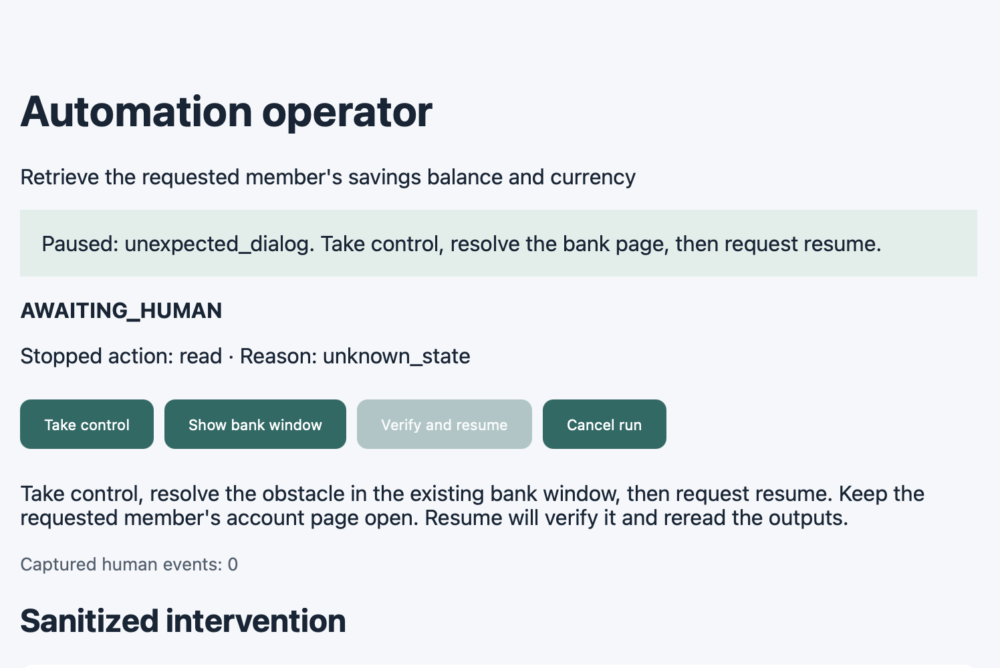
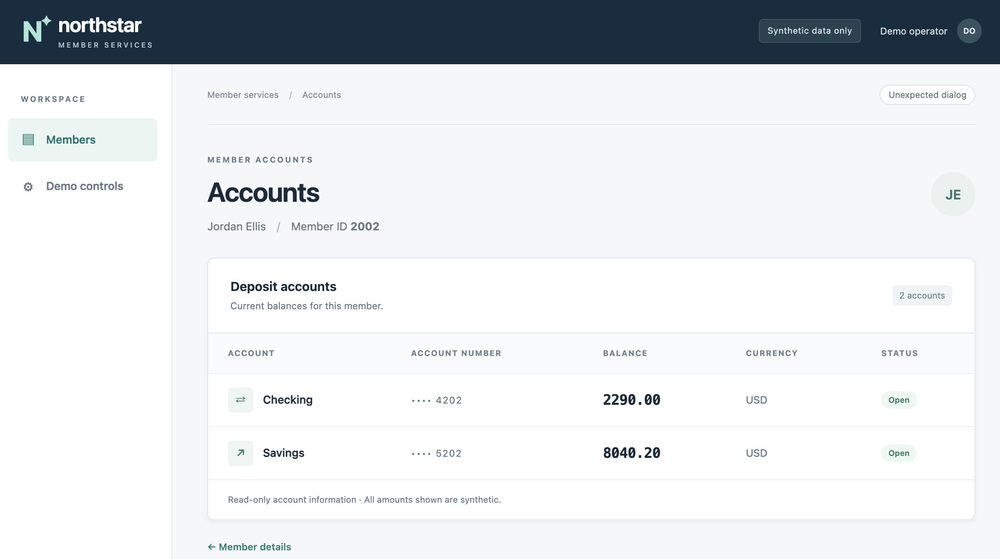

# Latest discovery, replay and handoff

I ran these demos on September 13, 2026 and captured the terminal results and
screenshots. The artifact and sanitized logs below are unchanged copies of those
runs. I performed the takeover manually; it was not a simulated-operator test.

## Discovery and reuse

- Discovery run: `a7139683-7087-438f-b9ce-69edc4ad9ae0`.
- Replay run: `8bba6ddf-5343-49a5-b658-899b758fec2a`.
- [Generated capability](capability.json): `read_savings_balance`, version 1.0.0,
  schema 1.0, provenance `llm_discovery`, target `synthetic_bank` version 1.0.
- [Discovery events](discovery/events.jsonl) contain six model responses and a
  successful completion with a verified checkpoint.
- [Replay events](replay/events.jsonl) contain no model requests or responses and
  end with successful completion and a verified checkpoint.

My discovery command for synthetic member `1001` returned `1250.75 USD`,
then I invoked `scripts/replay_without_model.py` with this exact generated file for
synthetic member `2002`, returning `8040.20 USD` and `model_used: false`. That
wrapper blocks model imports and removes API-key environment variables. The
diagnostic copies retain redaction; the literal values above come from my terminal results and screenshots,
not from decoding the redacted logs.

The configured provider/model was Gemini / `gemini-3.6-flash` with `low` reasoning.
This association follows the configured default and the command I ran. The
persisted model name is redacted, so these files are not an independent attestation
of the exact provider model. No new full source snapshot was captured at run time.
The manifest identifies the source revision available during packaging rather
than claiming a contemporaneous source attestation.

## Manual takeover

Run `e3ba20e6-db63-4c8b-9164-13a67db91f9c` uses session
`e1f52662-997a-4023-b2f2-dd095047b4ab` throughout. The [handoff log](handoff/events.jsonl)
records `AWAITING_HUMAN`, `HUMAN_CONTROL`, `RESUME_CHECK`, a return to
`AUTOMATION_RUNNING`, then `COMPLETED`. Three human interactions are captured:
click, submit and navigation. No automation action starts during human ownership.
The [resolution](handoff/ec437c72-5bb5-47bf-a99a-9387066e5003.json) records
`state_verified: true`; the final event records success and a verified checkpoint.

This separate demonstration was launched using `scripts/handoff_demo.py`, which
loads the older [Phase 7 capability](../phase7/capability.json). It does not prove
handoff using the newly generated capability. My terminal returned `8040.20 USD` at
completion. Structural failure diagnostics and the initial unresolved intervention
are retained alongside the successful resolution.

## Original UI screenshots

These are the original screenshots from my manual demo. All visible member names,
identifiers, account numbers and amounts are synthetic demonstration data.





The zero human-event count above is the state before takeover, not the final count.



The event log and verified resolution record resumed automation. The screenshots
show the manual sequence but do not contain run identifiers.

Two terminal screenshots contain a personal absolute filesystem path and are
excluded from this folder. The three included UI images are unchanged originals.
Operator URLs, tokens, and API keys are excluded.

## Reproduce

Start `uv run --locked python -m mock_app` in one terminal. In another, run:

```bash
uv run --locked computer-use discover \
  --goal "Read the requested member's savings balance and currency" \
  --inputs '{"member_id":"1001"}' --headless
```

Use the artifact path returned by that new discovery for a new reuse check.
To replay the artifact preserved in this folder, run:

```bash
uv run --locked python scripts/replay_without_model.py \
  evidence/latest-demo/capability.json --inputs '{"member_id":"2002"}' --headless
```

For the separate interactive demonstration, run:

```bash
uv run --locked python scripts/handoff_demo.py
```

Open the printed local operator URL, select **Take control**, acknowledge the
dialog in Chromium, then select **Verify and resume**. Do not publish that URL.
Only discovery needs a model key. [manifest.json](manifest.json) records file
hashes and the checks performed while packaging this evidence.
